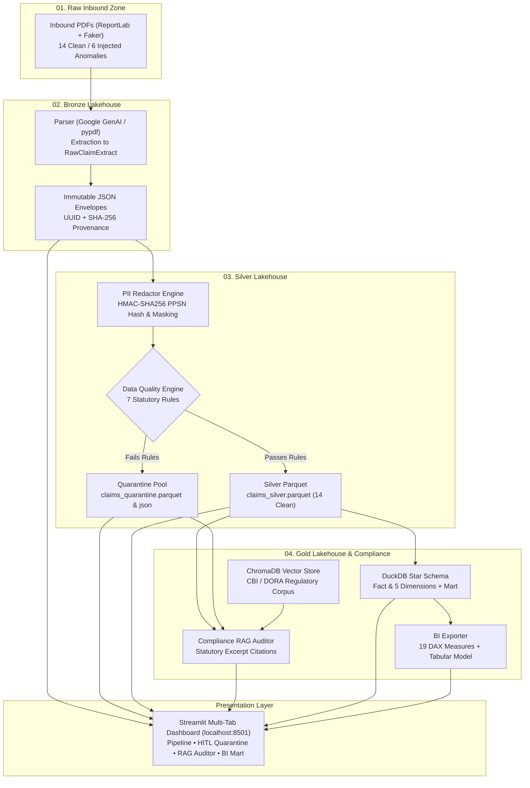

# 🛡️ Enterprise Regulatory & Operational Ingestion Engine

[](https://www.python.org/)
[](https://www.centralbank.ie/)
[-blueviolet.svg)](#architecture)
[](https://duckdb.org/)
[](https://www.trychroma.com/)
[](https://docs.pydantic.dev/)
[](https://streamlit.io/)

An enterprise-grade financial claims ingestion, data governance, and regulatory audit engine built for insurance undertakings (*Designated Activity Companies*) and financial entities subject to the **European Union Digital Operational Resilience Act (DORA - Regulation EU 2022/2554)** and **Central Bank of Ireland (CBI)** operational resilience guidelines.

---

## 📑 Table of Contents
- [Executive Overview](#-executive-overview)
- [System Architecture](#-system-architecture)
- [Directory Structure](#-directory-structure)
- [Regulatory & Statutory Rules Codified](#-regulatory--statutory-rules-codified)
- [Data Lakehouse Tiers](#-data-lakehouse-tiers)
- [Compliance RAG Subsystem](#-compliance-rag-subsystem)
- [Power BI & DAX Metrics](#-power-bi--dax-metrics)
- [Security & GitHub Secret Management](#-security--github-secret-management)
- [Quickstart & Execution Guide](#-quickstart--execution-guide)
- [Running Unit Tests](#-running-unit-tests)

---

## 🏛️ Executive Overview

Financial institutions face stringent supervisory deadlines, mathematical reconciliation standards, and restricted identifier privacy laws. This engine automates:

1. **Synthetic Loss Dossier Generation**: Creates localized, authentic Irish commercial property, cyber, and operational loss PDFs with ReportLab and Faker.
2. **Dual-Engine Ingestion**: Multimodal extraction using the **Google GenAI SDK (`gemini-2.5-flash`)** backed by an enterprise **deterministic fallback parser (`pypdf` + regex)**.
3. **GDPR & Irish PPSN Pseudonymization**: Hashes restricted Irish Personal Public Service Numbers using salted HMAC-SHA256, while masking contact info and coarsening geographic identifiers.
4. **Data Quality Gating & Quarantine Routing**: Automatically routes conformant records to **Silver Parquet** while isolating negative amounts, missing policies, and SLA breaches into an auditable **Quarantine Pool**.
5. **DORA Semantic RAG Auditor**: Queries a **ChromaDB** vector store to cross-reference claims against statutory regulations and generate auditable compliance citations.
6. **DuckDB Star Schema & BI Export**: Transforms Silver data into a 6-table dimensional model, exporting **19 production DAX measures** and a Power BI Tabular Model schema.
7. **Human-in-the-Loop (HITL) Dashboard**: A 4-tab **Streamlit** control center for ingestion management, quarantine adjudication, live regulatory search, and portfolio analytics.

---

## 🏗️ System Architecture



---

## 📁 Directory Structure

```text
financial-ingestion-audit-engine/
├── .env.example                       # Template for environment variables (API keys, salts)
├── .gitignore                         # Comprehensive ignore list (secrets, vector DBs, caches)
├── README.md                          # Repository documentation & architectural overview
├── requirements.txt                   # Pinned enterprise dependencies
├── app.py                             # Multi-tab Streamlit Command Center
├── config/
│   ├── settings.py                    # Strongly typed Pydantic v2 application settings
│   └── regulatory_rules.yaml          # Declarative statutory rule definitions
├── data/
│   ├── 01_raw_inbound/                # Ingested PDF dossiers (.gitkeep)
│   ├── 02_bronze_lakehouse/           # Immutable JSON extraction envelopes (.gitkeep)
│   ├── 03_silver_lakehouse/           # Governed Silver Parquet & Quarantine logs (.gitkeep)
│   ├── 04_gold_lakehouse/             # Dimensional Star Schema & BI Exports (.gitkeep)
│   │   ├── star_schema/               # Fact & dimension Parquet files
│   │   └── bi_export/                 # DAX measures, Tabular Model JSON, CSV feeds
│   └── chroma_db/                     # Local persistent vector database (git-ignored)
├── regulatory_corpus/
│   └── cbi_dora_guidelines.txt        # Codified Central Bank of Ireland & DORA regulations
├── src/
│   ├── generators/
│   │   └── synthetic_docs.py          # ReportLab & Faker PDF generator (14 clean, 6 anomalies)
│   ├── extraction/
│   │   ├── schemas.py                 # Pydantic v2 extraction & envelope models
│   │   └── parser.py                  # Google GenAI SDK & resilient fallback parser
│   ├── governance/
│   │   ├── pii_redactor.py            # HMAC-SHA256 PPSN hashing & contact masking
│   │   └── quality_engine.py          # 7 statutory quality checks & quarantine routing
│   ├── compliance_rag/
│   │   ├── vector_store.py            # ChromaDB dense vector indexing & semantic search
│   │   └── auditor.py                 # Automated supervisory compliance auditor
│   └── analytics/
│       ├── lakehouse.py               # DuckDB OLAP Star Schema transformation engine
│       └── bi_exporter.py             # 19 DAX measures & Power BI Tabular Model export
└── tests/
    └── test_governance.py             # Pytest suite for PII redaction and quality gating
```

---

## ⚖️ Regulatory & Statutory Rules Codified

| Rule Identifier | Regulatory Framework | Statutory Reference | Description | Failure Action |
|---|---|---|---|---|
| `RULE_POLICY_NUMBER_PRESENT` | CBI Consumer Protection Code | Section 4.1 & 4.2 | Mandatory active insurance policy identifier | Quarantine |
| `RULE_POSITIVE_AMOUNTS` | CBI Solvency & Claims Protocol | Section 5.1 & 5.2 | Net liquidation and loss values must be $> €0.00$ | Quarantine |
| `RULE_TIMELY_NOTIFICATION` | DORA Article 19 & CBI SLA | Section 3.2 | Notice latency must not exceed 90 calendar days | Quarantine |
| `RULE_ALLOWED_CURRENCY` | ISO 4217 Currency Standards | Section 1.2 | Permitted currencies: `EUR`, `USD`, `GBP`, `CHF` | Quarantine |
| `RULE_VALID_PPSN_FORMAT` | Irish Data Protection Act 2018 | Section 6.1 | Must adhere to statutory 7-digit + letter syntax | Flag Warning |
| `RULE_LEDGER_RECONCILED` | Claims Liquidation Standards | Section 5.3 | $\sum (\text{Line Items}) = \text{Total Net Claim} \pm €0.05$ | Quarantine |
| `RULE_METADATA_COMPLETENESS`| CBI Minimum Operational Req. | Section 2.2 | Mandatory dates, incident peril, and Irish county | Quarantine |

---

## 🔒 Security & GitHub Secret Management

> [!WARNING]
> **NEVER commit sensitive credentials, API keys, or raw personal data to GitHub!**

### What Should NOT Be Committed to Git:
1. **`.env` Files**: Contains private keys and salts (`GEMINI_API_KEY`, `GOOGLE_API_KEY`, `ENGINE_GOVERNANCE__SALT`). Always use [.env.example](file:///C:/Users/chava/.gemini/antigravity-ide/scratch/financial-ingestion-audit-engine/.env.example).
2. **`data/chroma_db/`**: Local SQLite database and vector index binaries. These are auto-generated on first run.
3. **Generated Lakehouse Payloads**: Raw PDFs, Bronze JSONs, Silver Parquet tables, and Gold mart files contain synthetic run outputs and should be ignored (directory structure is preserved via `.gitkeep`).
4. **Python Cache & Environments**: `__pycache__/`, `.pytest_cache/`, `venv/`.

### Verified Safeguards in This Repository:
- A production [.gitignore](file:///C:/Users/chava/.gemini/antigravity-ide/scratch/financial-ingestion-audit-engine/.gitignore) is pre-configured to block `.env`, `chroma_db/`, and generated lakehouse binaries.
- The codebase contains **zero hardcoded API keys**; credentials are read dynamically from `os.environ`.
- The PII Redaction engine ensures **zero plaintext PPSNs** or unmasked contact details are persisted into downstream Silver or Gold layers.

---

## 📊 Power BI & DAX Metrics

The engine exports **19 enterprise DAX measures** in [dax_measures.dax](file:///C:/Users/chava/.gemini/antigravity-ide/scratch/financial-ingestion-audit-engine/data/04_gold_lakehouse/bi_export/dax_measures.dax) alongside a complete Tabular Object Model in [powerbi_tabular_model.json](file:///C:/Users/chava/.gemini/antigravity-ide/scratch/financial-ingestion-audit-engine/data/04_gold_lakehouse/bi_export/powerbi_tabular_model.json):

| Measure Name | DAX Formula | Category | Format |
|---|---|---|---|
| **Total Net Claim Amount** | `SUM('fact_claims'[net_claimed_amount])` | Financial KPIs | `€#,##0.00` |
| **Total Gross Loss** | `SUM('fact_claims'[gross_loss_amount])` | Financial KPIs | `€#,##0.00` |
| **Average Net Claim Value** | `AVERAGE('fact_claims'[net_claimed_amount])` | Financial KPIs | `€#,##0.00` |
| **SLA Compliant Claims** | `CALCULATE(COUNTROWS('fact_claims'), 'fact_claims'[is_timely_sla_compliant] = 1)` | Regulatory | `#,##0` |
| **Statutory SLA Compliance %** | `DIVIDE([SLA Compliant Claims Count], [Total Claims Count], 0)` | Regulatory | `0.0%` |
| **Major DORA Incidents** | `CALCULATE(COUNTROWS('fact_claims'), 'fact_claims'[is_major_dora_incident] = 1)` | Regulatory | `#,##0` |
| **Major DORA Total Exposure**| `CALCULATE([Total Net Claim Amount], 'fact_claims'[is_major_dora_incident] = 1)` | Regulatory | `€#,##0.00` |
| **Major DORA Exposure Share** | `DIVIDE([Major DORA Total Exposure], [Total Net Claim Amount], 0)` | Regulatory | `0.0%` |
| **ICT Related Claims Exposure**| `CALCULATE([Total Net Claim Amount], FILTER('dim_incident_classification', 'dim_incident_classification'[is_ict_related] = TRUE()))` | Regulatory | `€#,##0.00` |
| **Claims Net Amount MTD** | `TOTALMTD([Total Net Claim Amount], 'dim_date'[full_date])` | Time Intelligence | `€#,##0.00` |

---

## 🚀 Quickstart & Execution Guide

### 1. Prerequisites
- Python 3.11+
- Git

### 2. Installation
```bash
# Clone the repository
git clone https://github.com/your-username/financial-ingestion-audit-engine.git
cd financial-ingestion-audit-engine

# Create and activate virtual environment
python -m venv venv
source venv/bin/activate  # On Windows: .\venv\Scripts\activate

# Install dependencies
pip install -r requirements.txt
```

### 3. Environment Configuration
```bash
# Copy template configuration
cp .env.example .env

# Optional: Add your GEMINI_API_KEY to .env for multimodal GenAI extraction
# (If omitted, the engine automatically uses its resilient deterministic fallback parser)
```

### 4. Run the Streamlit Command Center
```bash
streamlit run app.py
```
Open **`http://localhost:8501`** in your browser to access the 4-tab interactive dashboard.

---

## 🧪 Running Unit Tests

The test suite validates cryptographic PPSN pseudonymization, contact masking, and quality engine rejection of injected anomalies:

```bash
pytest tests/test_governance.py -v
```

